# 20260816 

From *The Little Prince*, by Antoine de Saint-Exupéry, Translated by Katherine Woods

## Chapter I

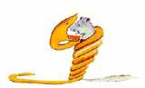

Once when I was six years old I saw a magnificent picture in a book, called True Stories from Nature, about the primeval[^1] forest. It was a picture of a boa constrictor[^2] in the act of[^3] swallowing an animal. Here is a copy of the drawing.

In the book it said: "Boa constrictors swallow their prey whole, without chewing it. After that they are not able to move, and they sleep through the six months that they need for digestion."

I pondered deeply, then, over the adventures of the jungle. And after some work with a coloured pencil I succeeded in making my first drawing. My Drawing Number One. It looked like this:

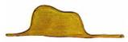

I showed my masterpiece to the grown-ups, and asked them whether the drawing frightened them.

But they answered: "Frighten? Why should any one be frightened by a hat?"

My drawing was not a picture of a hat. It was a picture of a boa constrictor digesting an elephant. But since the grown-ups were not able to understand it, I made another drawing: I drew the inside of the boa constrictor, so that the grown-ups could see it clearly. They always need to have things explained. My Drawing Number Two looked like this:

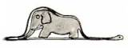

The grown-ups' response, this time, was to advise me to lay aside my drawings of boa constrictors, whether from the inside or the outside, and devote myself instead to geography, history, arithmetic and grammar. That is why, at the age of six, I gave up what might have been a magnificent career as a painter. I had been disheartened[^4] by the failure of my Drawing Number One and my Drawing Number Two. Grown-ups never understand anything by themselves, and it is tiresome for children to be always and forever explaining things to them.

So then I chose another profession, and learned to pilot[^5] airplanes. I have flown a little over all parts of the world; and it is true that geography has been very useful to me. At a glance I can distinguish China from Arizona. If one gets lost in the night, such knowledge is valuable.

In the course[^6] of this life I have had a great many encounters with a great many people who have been concerned with matters of consequence. I have lived a great deal among grown-ups. I have seen them intimately, close at hand[^7]. And that hasn't much improved my opinion of them.

Whenever I met one of them who seemed to me at all clear-sighted[^8], I tried the experiment of showing him my Drawing Number One, which I have always kept. I would try to find out, so, if this was a person of true understanding. But, whoever it was, he, or she, would always say: "That is a hat."

Then I would never talk to that person about boa constrictors, or primeval forests, or stars. I would bring myself down to his level. I would talk to him about bridge, and golf, and politics, and neckties[^9]. And the grown-up would be greatly pleased to have met such a sensible[^10] man.

## Chapter II

So I lived my life alone, without anyone that I could really talk to, until I had an accident with my plane in the Desert of Sahara, six years ago. Something was broken in my engine. And as I had with me neither a mechanic nor any passengers, I set myself to attempt the difficult repairs all alone. It was a question of life or death for me: I had scarcely enough drinking water to last a week. The first night, then, I went to sleep on the sand, a thousand miles from any human habitation[^11]. I was more isolated than a shipwrecked[^12] sailor on a raft in the middle of the ocean. Thus you can imagine my amazement, at sunrise, when I was awakened by an odd little voice. It said:

"If you please—draw me a sheep!"

"What!"

"Draw me a sheep!"

I jumped to my feet, completely thunderstruck[^13]. I blinked[^14] my eyes hard. I looked carefully all around me. And I saw a most extraordinary small person, who stood there examining me with great seriousness. Here you may see the best portrait that, later, I was able to make of him. But my drawing is certainly very much less charming than its model.

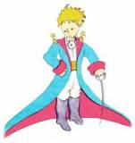

That, however, is not my fault. The grown-ups discouraged me in my painter's career when I was six years old, and I never learned to draw anything, except boas from the outside and boas from the inside.

Now I stared at this sudden apparition[^15] with my eyes fairly starting out of my head in astonishment. Remember, I had crashed in the desert a thousand miles from any inhabited region. And yet my little man seemed neither to be straying[^16] uncertainly among the sands, nor to be fainting[^17] from fatigue or hunger or thirst or fear. Nothing about him gave any suggestion of a child lost in the middle of the desert, a thousand miles from any human habitation. When at last I was able to speak, I said to him:

"But—what are you doing here?"

And in answer he repeated, very slowly, as if he were speaking of a matter of great consequence:

"If you please—draw me a sheep..."

When a mystery is too overpowering[^18], one dare not disobey[^19]. Absurd as it might seem to me, a thousand miles from any human habitation and in danger of death, I took out of my pocket a sheet of paper and my fountain pen[^20]. But then I remembered how my studies had been concentrated on geography, history, arithmetic, and grammar, and I told the little chap[^21] (a little crossly[^22], too) that I did not know how to draw. He answered me:

"That doesn't matter. Draw me a sheep..."

But I had never drawn a sheep. So I drew for him one of the two pictures I had drawn so often. It was that of the boa constrictor from the outside. And I was astounded to hear the little fellow greet it with,

"No, no, no! I do not want an elephant inside a boa constrictor. A boa constrictor is a very dangerous creature, and an elephant is very cumbersome[^23]. Where I live, everything is very small. What I need is a sheep. Draw me a sheep."

So then I made a drawing.

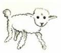

He looked at it carefully, then he said:

"No. This sheep is already very sickly[^24]. Make me another."

So I made another drawing.

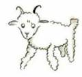

My friend smiled gently and indulgently[^25].

"You see yourself," he said, "that this is not a sheep. This is a ram[^26]. It has horns."

So then I did my drawing over once more.

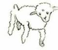

But it was rejected too, just like the others.

"This one is too old. I want a sheep that will live a long time."

By this time my patience was exhausted, because I was in a hurry to start taking my engine apart.

So I tossed off this drawing. And I threw out an explanation with it.

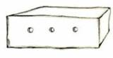

"This is only his box. The sheep you asked for is inside."

I was very surprised to see a light break[^27] over the face of my young judge:

"That is exactly the way I wanted it! Do you think that this sheep will have to have a great deal of grass?"

"Why?"

"Because where I live everything is very small..."

"There will surely be enough grass for him," I said. "It is a very small sheep that I have given you."

He bent his head over the drawing:

"Not so small that—Look! He has gone to sleep..."

And that is how I made the acquaintance of[^28] the little prince.

## Chapter III

It took me a long time to learn where he came from. The little prince, who asked me so many questions, never seemed to hear the ones I asked him. It was from words dropped by chance that, little by little, everything was revealed to me.

The first time he saw my airplane, for instance (I shall not draw my airplane; that would be much too complicated for me), he asked me:

"What is that object?"

"That is not an object. It flies. It is an airplane. It is my airplane."

And I was proud to have him learn that I could fly.

He cried out, then:

"What! You dropped down from the sky?"

"Yes," I answered, modestly.

"Oh! That is funny!"

And the little prince broke into a lovely peal[^29] of laughter, which irritated me very much. I like my misfortunes to be taken seriously.

Then he added:

"So you, too, come from the sky! Which is your planet?"

At that moment I caught a gleam[^30] of light in the impenetrable[^31] mystery of his presence; and I demanded, abruptly:

"Do you come from another planet?"

But he did not reply. He tossed his head gently, without taking his eyes from my plane:

"It is true that on that you can't have come from very far away..."

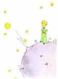

And he sank into a reverie[^32], which lasted a long time. Then, taking my sheep out of his pocket, he buried himself in the contemplation of his treasure.

You can imagine how my curiosity was aroused by this half-confidence about the "other planets." I made a great effort, therefore, to find out more on this subject.

"My little man, where do you come from? What is this 'where I live,' of which you speak? Where do you want to take your sheep?"

After a reflective silence he answered:

"The thing that is so good about the box you have given me is that at night he can use it as his house."

"That is so. And if you are good I will give you a string, too, so that you can tie him during the day, and a post to tie him to."

But the little prince seemed shocked by this offer:

"Tie him! What a queer[^33] idea!"

"But if you don't tie him," I said, "he will wander off somewhere, and get lost."

My friend broke into another peal of laughter:

"But where do you think he would go?"

"Anywhere. Straight ahead of him."

Then the little prince said, earnestly[^34]:

"That doesn't matter. Where I live, everything is so small!"

And, with perhaps a hint of sadness, he added:

"Straight ahead of him, nobody can go very far..."

## Chapter IV

I had thus learned a second fact of great importance: this was that the planet the little prince came from was scarcely any larger than a house!

But that did not really surprise me much. I knew very well that in addition to the great planets—such as the Earth, Jupiter[^35], Mars[^36], Venus[^37]—to which we have given names, there are also hundreds of others, some of which are so small that one has a hard time seeing them through the telescope. When an astronomer discovers one of these he does not give it a name, but only a number. He might call it, for example, "Asteroid[^38] 325."

I have serious reason to believe that the planet from which the little prince came is the asteroid known as B-612.

This asteroid has only once been seen through the telescope. That was by a Turkish astronomer, in 1909.

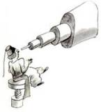

On making his discovery, the astronomer had presented it to the International Astronomical Congress, in a great demonstration. But he was in Turkish costume, and so nobody would believe what he said.

Grown-ups are like that...

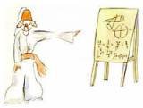

Fortunately, however, for the reputation of Asteroid B-612, a Turkish dictator made a law that his subjects[^39], under pain of death, should change to European costume. So in 1920 the astronomer gave his demonstration all over again, dressed with impressive style and elegance. And this time everybody accepted his report.

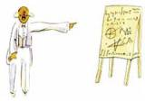

If I have told you these details about the asteroid, and made a note of its number for you, it is on account of[^40] the grown-ups and their ways. When you tell them that you have made a new friend, they never ask you any questions about essential matters. They never say to you, "What does his voice sound like? What games does he love best? Does he collect butterflies?" Instead, they demand: "How old is he? How many brothers has he? How much does he weigh? How much money does his father make?" Only from these figures do they think they have learned anything about him.

If you were to say to the grown-ups: "I saw a beautiful house made of rosy brick, with geraniums[^41] in the windows and doves on the roof," they would not be able to get any idea of that house at all. You would have to say to them: "I saw a house that cost $20,000." Then they would exclaim: "Oh, what a pretty house that is!"

Just so, you might say to them: "The proof that the little prince existed is that he was charming, that he laughed, and that he was looking for a sheep. If anybody wants a sheep, that is a proof that he exists." And what good would it do to tell them that? They would shrug their shoulders, and treat you like a child. But if you said to them: "The planet he came from is Asteroid B-612," then they would be convinced, and leave you in peace from their questions.

They are like that. One must not hold it against them. Children should always show great forbearance[^42] toward grown-up people.

But certainly, for us who understand life, figures are a matter of indifference. I should have liked to begin this story in the fashion of the fairy-tales. I should have like to say: "Once upon a time there was a little prince who lived on a planet that was scarcely any bigger than himself, and who had need of a sheep..."

To those who understand life, that would have given a much greater air of truth to my story.

For I do not want any one to read my book carelessly. I have suffered too much grief in setting down these memories. Six years have already passed since my friend went away from me, with his sheep. If I try to describe him here, it is to make sure that I shall not forget him. To forget a friend is sad. Not every one has had a friend. And if I forget him, I may become like the grown-ups who are no longer interested in anything but figures...

It is for that purpose, again, that I have bought a box of paints and some pencils. It is hard to take up drawing again at my age, when I have never made any pictures except those of the boa constrictor from the outside and the boa constrictor from the inside, since I was six. I shall certainly try to make my portraits as true to life as possible. But I am not at all sure of success. One drawing goes along all right, and another has no resemblance to its subject. I make some errors, too, in the little prince's height: in one place he is too tall and in another too short. And I feel some doubts about the colours of his costume. So I fumble[^43] along as best I can, now good, now bad, and I hope generally fair-to-middling[^44].

In certain more important details I shall make mistakes, also. But that is something that will not be my fault. My friend never explained anything to me. He thought, perhaps, that I was like himself. But I, alas[^45], do not know how to see sheep through the walls of boxes. Perhaps I am a little like the grown-ups. I have had to grow old.

## Chapter V

As each day passed I would learn, in our talk, something about the little prince's planet, his departure from it, his journey. The information would come very slowly, as it might chance to fall from his thoughts. It was in this way that I heard, on the third day, about the catastrophe of the baobabs[^46].

This time, once more, I had the sheep to thank for it. For the little prince asked me abruptly—as if seized[^47] by a grave[^48] doubt—"It is true, isn't it, that sheep eat little bushes?"

"Yes, that is true."

"Ah! I am glad!"

I did not understand why it was so important that sheep should eat little bushes. But the little prince added:

"Then it follows that they also eat baobabs?"

I pointed out to the little prince that baobabs were not little bushes, but, on the contrary, trees as big as castles; and that even if he took a whole herd of elephants away with him, the herd would not eat up one single baobab.

The idea of the herd of elephants made the little prince laugh.

"We would have to put them one on top of the other," he said.

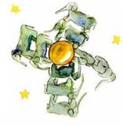

But he made a wise comment:

"Before they grow so big, the baobabs start out by being little."

"That is strictly correct," I said. "But why do you want the sheep to eat the little baobabs?"

He answered me at once, "Oh, come, come!", as if he were speaking of something that was self-evident. And I was obliged[^49] to make a great mental effort to solve this problem, without any assistance.

Indeed, as I learned, there were on the planet where the little prince lived—as on all planets—good plants and bad plants. In consequence, there were good seeds from good plants, and bad seeds from bad plants. But seeds are invisible. They sleep deep in the heart of the earth's darkness, until some one among them is seized with the desire to awaken. Then this little seed will stretch itself and begin—timidly[^50] at first—to push a charming little sprig[^51] inoffensively upward toward the sun. If it is only a sprout[^52] of radish[^53] or the sprig of a rose-bush, one would let it grow wherever it might wish. But when it is a bad plant, one must destroy it as soon as possible, the very first instant that one recognizes it.

Now there were some terrible seeds on the planet that was the home of the little prince; and these were the seeds of the baobab. The soil of that planet was infested[^54] with them. A baobab is something you will never, never be able to get rid of if you attend to it too late. It spreads over the entire planet. It bores clear through it with its roots. And if the planet is too small, and the baobabs are too many, they split it in pieces...

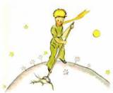

"It is a question of discipline," the little prince said to me later on. "When you've finished your own toilet in the morning, then it is time to attend to the toilet of your planet, just so, with the greatest care. You must see to it that you pull up regularly all the baobabs, at the very first moment when they can be distinguished from the rosebushes which they resemble so closely in their earliest youth. It is very tedious work," the little prince added, "but very easy."

And one day he said to me: "You ought to make a beautiful drawing, so that the children where you live can see exactly how all this is. That would be very useful to them if they were to travel some day. Sometimes," he added, "there is no harm in putting off a piece of work until another day. But when it is a matter of baobabs, that always means a catastrophe. I knew a planet that was inhabited by a lazy man. He neglected three little bushes..."

So, as the little prince described it to me, I have made a drawing of that planet. I do not much like to take the tone of a moralist. But the danger of the baobabs is so little understood, and such considerable risks would be run by anyone who might get lost on an asteroid, that for once I am breaking through my reserve. "Children," I say plainly, "watch out for the baobabs!"

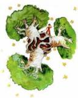

My friends, like myself, have been skirting this danger for a long time, without ever knowing it; and so it is for them that I have worked so hard over this drawing. The lesson which I pass on by this means is worth all the trouble it has cost me.

Perhaps you will ask me, "Why are there no other drawing in this book as magnificent and impressive as this drawing of the baobabs?"

The reply is simple. I have tried. But with the others I have not been successful. When I made the drawing of the baobabs I was carried beyond myself by the inspiring force of urgent necessity.

## Chapter VI

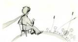

Oh, little prince! Bit by bit I came to understand the secrets of your sad little life... For a long time you had found your only entertainment in the quiet pleasure of looking at the sunset. I learned that new detail on the morning of the fourth day, when you said to me:

"I am very fond of sunsets. Come, let us go look at a sunset now."

"But we must wait," I said.

"Wait? For what?"

"For the sunset. We must wait until it is time."

At first you seemed to be very much surprised. And then you laughed to yourself. You said to me:

"I am always thinking that I am at home!"

Just so. Everybody knows that when it is noon in the United States the sun is setting over France.

If you could fly to France in one minute, you could go straight into the sunset, right from noon. Unfortunately, France is too far away for that. But on your tiny planet, my little prince, all you need do is move your chair a few steps. You can see the day end and the twilight[^55] falling whenever you like...

"One day," you said to me, "I saw the sunset forty-four times!"

And a little later you added:

"You know—one loves the sunset, when one is so sad..."

"Were you so sad, then?" I asked, "on the day of the forty-four sunsets?"

But the little prince made no reply.

[^1]: primeval/praɪˈmiːvl: (British English also primaeval) [usually before noun]  from the earliest period of the history of the world, very ancient远古的；原始的 primeval forests 原始森林 primeval soup (= the mixture of gases and substances that is thought to have existed when the earth was formed and from which life started) 原始汤

[^2]: boa constrictor: (also boa) a large South American snake that kills animals for food by winding its long body tightly around them巨蚺（南美蟒，捕食时把猎物缢死）

[^3]: in the act of: while you are doing something正在（做某事）；当场 He was caught in the act of stealing a car. 他偷汽车时被当场逮个正着。 It is often difficult to tell when someone is using drugs unless they are caught in the act. 除非被当场抓住，否则很难判断一个人何时在吸毒。

[^4]: disheartened: having lost hope or confidence使沮丧；使失去信心；使灰心 **synonym** discouraged a disheartened team 丧失信心的团队 I am disheartened by their attitude. 我对他们的态度感到沮丧。

[^5]: pilot: pilot something to fly an aircraft or guide a ship; to act as a pilot驾驶（航空器）；领航（船只） The plane was piloted by the instructor. 飞机由教练员驾驶。 The captain piloted the boat into a mooring. 船长把船驶向泊位。

[^6]: in/over the course of…: (used with expressions for periods of time与表示时间段的词组连用) during 在…期间；在…的时候 He's seen many changes in the course of his long life. 他在漫长的一生中目睹了许许多多的变化。 The company faces major challenges over the course of the next few years. 这家公司今后几年将面临重大的挑战。

[^7]: close at hand: near; in a place where somebody/something can be reached easily在附近；在触手可及的地方 There are good cafes and a restaurant close at hand. 附近有几家挺不错的咖啡馆和一家餐馆。

[^8]: clear-sighted: understanding or thinking clearly; able to make good decisions and judgements明白的；头脑清楚的；有眼光的

[^9]: necktie: (North American English or old-fashioned) (also tie British and North American English) a long narrow piece of cloth worn around the neck, especially by men, with a knot in front领带

[^10]: sensible: (of people and their behaviour人及其行为) able to make good judgements based on reason and experience rather than emotion; practical明智的；理智的；合理的；切合实际的 She's a sensible sort of person. 她属于那种通情达理的人。 I think that's a very sensible idea. 我看这个主意很妥当。 I think the sensible thing would be to take a taxi home. 我想还是坐出租车回家比较好。 Say something sensible. 说点正经的。 a sensible approach/decision/solution/option 明智的方法/决定/解决方案/选择 Diplomacy is the only sensible way to resolve this dispute. 外交是解决这一争端的唯一明智的方法。 This is an eminently sensible approach.这是一个非常明智的方法。  **sensible about something**  We have to be sensible about this. 我们必须对此保持理智。 We are just asking people to be sensible about the amount of water they use. 我们只是要求人们对他们使用的水量保持理智。  **it is sensible to do something**  It is sensible to have contingency plans in place. 制定应急计划是明智的。  it is sensible for somebody to do something It would be sensible for the government to take precautionary measures. 政府采取预防措施是明智的。

[^11]: habitation: [countable] (formal) a place where people live住处；住所；聚居地 The road serves the scattered habitations along the coast. 这条路连接着海岸线上分散各处的聚居地。

[^12]: shipwrecked: having been sailing in a ship that was then lost or destroyed at sea失事的船；沉船 a shipwrecked sailor 遭遇海难的水手

[^13]: thunderstruck: [not usually before noun] extremely surprised and shocked大吃一惊 **synonym** amazed

[^14]: blink: [intransitive, transitive] blink (something) when you blink or blink your eyes or your eyes blink, you shut and open your eyes quickly眨眼睛 He blinked in the bright sunlight. 他在强烈的阳光下直眨眼睛。 Lucy blinked at him in astonishment. 露西惊讶地向他眨了眨眼。 I'll be back before you can blink (= very quickly). 我眨眼工夫就回来。 When I told him the news he didn't even blink (= showed no surprise at all). 我把那个消息告诉他时，他眼都没眨一下。

[^15]: apparition/ˌæpəˈrɪʃn/: a ghost or a ghost-like image of a person who is dead（人死后的）鬼，鬼魂，幽灵 late Middle English (in the sense ‘the action of appearing’): from Latin *apparitio(n-)* ‘attendance’, from the verb *apparere*, from *ad-* ‘towards’ + *parere* ‘come into view’. Apparitions of a woman in white robes have been reported. 有报道说有白衣女鬼显现。

[^16]: stray: [intransitive] (+ adv./prep.) to move away from the place where you should be, without intending to迷路；偏离；走失 He strayed into the path of an oncoming car. 他偏到了一辆迎面驶来的汽车的行车路线上。 Her eyes kept straying over to the clock on the wall. 她的目光不时瞟向墙上的钟。 His hand strayed to the telephone. 他的手伸向电话。 He can’t have strayed far. 他不可能走远了。 I strayed a few blocks in the wrong direction and became hopelessly lost. 我走错了几个街区，迷路了。

[^17]: faint: to become unconscious when not enough blood is going to your brain, usually because of the heat, a shock, etc.昏厥 **synonym** pass out to faint from hunger 饿昏过去 Suddenly the woman in front of me fainted.我面前的女人突然昏倒了。 I'm nearly fainting with the heat in here.这里太热了，我都快晕倒了。  (informal) I almost fainted (= I was very surprised) when she told me. 她告诉我时我吃惊得差点儿昏过去。

[^18]: overpowering: very strong or powerful强烈的；极强大的；坚强的 an overpowering smell of fish 浓烈的鱼腥味儿 an overpowering personality 极强的个性 The heat was overpowering. 酷热难当。 a totally overpowering sense of failure 完全压倒一切的失败感

[^19]: disobey: disobey (somebody/something) to refuse to do what a person, a law, an order, etc. tells you to do; to refuse to obey不服从；不顺从；违抗 He was punished for disobeying orders. 他因违抗命令而受到惩罚。 How dare you disobey me! 你竟敢不听我的！ She sighed deeply but dared not disobey. 她深深叹了口气，但不敢违抗。

[^20]: fountain pen: a pen with a container that you fill with ink (= coloured liquid for writing) that flows to a nib自来水笔

[^21]: chap: (British English, informal, old-fashioned) used to talk about a man in a friendly way（对男子的友好称呼）家伙，伙计 He isn't such a bad chap really. 他这个家伙并不真的这么坏。 Come on, chaps, let’s go for a drink! 来吧，伙计们，我们去喝一杯！

[^22]: crossly: in an annoyed or slightly angry way交叉：以恼火或略带生气的方式 ‘Well what did you expect?’ she said crossly. “咳，你还想怎么着？” 她气愤地说。

[^23]: cumbersome: large and heavy; difficult to carry大而笨重的；难以携带的 **synonym** bulky cumbersome machinery 笨重的机器

[^24]: sickly:  1. often ill常生病的；多病的；爱闹病的 He was a sickly child. 他是个爱闹病的孩子。 2. not looking healthy and strong不健壮的；体弱的；有病容的 **synonym** frail She looked pale and sickly. 她面色苍白，病恹恹的。 sickly plants 长势差的植物

[^25]: indulgently: in a way that shows you are willing or too willing to ignore the weaknesses in somebody/something宽容的；过于宽厚的 to laugh indulgently 宽容地笑 Ideas that were viewed indulgently in 1997 are unacceptable to the public now.  1997年被宽容地看待的观点，现在公众是无法接受的。

[^26]: ram: a male sheep公羊

[^27]: break of day/dawn: (literary) the moment in the early hours of the morning when it begins to get light破晓；黎明

[^28]: make somebody’s acquaintance | make the acquaintance of somebody: (formal) to meet somebody for the first time与某人初次相见；结识某人 I am delighted to make your acquaintance, Mrs Baker. 贝克太太，我很高兴与您相识。 I made the acquaintance of several musicians around that time. 大约在那段时间，我结识了几位音乐家。 I first made his acquaintance in 1992. 我是在1992 年认识他的。

[^29]: peal: peal (of something) a loud sound or series of sounds响亮的声音；轰轰的响声 She burst into peals of laughter. 她忽然哈哈大笑起来。 A peal of thunder broke overhead. 头顶上响起了一声雷鸣。

[^30]: gleam: a small amount of something少量；一丝；一线 Old English *glǣm* ‘brilliant light’, of Germanic origin. a faint gleam of hope 微弱的一线希望 a serious book with an occasional gleam of humour 偶有一丝幽默的严肃的书

[^31]: impenetrable: impossible to understand不可理解的；高深莫测的 **synonym** incomprehensible an impenetrable mystery不解之谜 Her expression was impenetrable.她的表情难以理解。 **impenetrable to somebody** Their jargon is impenetrable to an outsider. 他们的行话外人听不懂。

[^32]: reverie/ˈrevəri/: [countable, uncountable] (formal) a state of thinking about pleasant things, almost as though you are dreaming幻想；白日梦；梦想 early 17th cent.: from obsolete French *resverie*, from Old French *reverie* ‘rejoicing, revelry’, from *rever* ‘be delirious’, of unknown ultimate origin. **synonym** daydream She was jolted out of her reverie as the door opened. 门一开就把她从幻想中惊醒。

[^33]: queer/kwɪə(r)/: (old-fashioned) strange or unusual奇怪的；反常的 **synonym** odd His face was a queer pink colour. 他满脸奇怪的粉红色。 She had a queer feeling that she was being watched. 她有种奇怪的感觉，觉得有人在监视她。 I was beginning to feel very queer. 我开始觉得很奇怪。 It all sounds a bit queer to me. 我觉得这一切听起来有点奇怪。

[^34]: earnestly: in a very serious and sincere way非常认真的；真诚的 He gazed earnestly into my eyes. 他认真地凝视着我的眼睛。

[^35]: Jupiter: the largest planet of the solar system, fifth in order of distance from the sun木星（太阳系中最大的行星）

[^36]: Mars/mɑːz/: the planet in the solar system that is fourth in order of distance from the sun, between the Earth and Jupiter火星

[^37]: Venus/ˈviːnəs/: the planet in the solar system that is second in order of distance from the sun, between Mercury and the Earth金星；太白星

[^38]: Asteroid: any one of the many small planets that go around the sun小行星

[^39]: subject: a person who belongs to a particular country, especially one with a king or queen（尤指君主制国家的）国民，臣民 a British subject 英国国民 The prince had to tax his subjects heavily to raise money for the war. 国王不得不对他的臣民征重税来为战争筹款。

[^40]: on account of somebody/something: because of somebody/something由于；因为 She retired early on account of ill health. 她体弱多病，所以提前退休。 The marsh is an area of great scientific interest on account of its wild flowers. 这片沼泽因其野花而成为极具科学价值的地区。

[^41]: geranium/dʒəˈreɪniəm/: a garden plant with a mass of red, pink or white flowers on the end of each stem天竺葵；老鹳草

[^42]: forbearance/fɔːˈbeərəns/: [uncountable] (formal)the quality of being patient and kind towards other people, especially when they have done something wrong宽容 The mortgage company had acted with forbearance, only taking them to court as a last resort. 抵押贷款公司已经忍无可忍，只是把他们告上法庭作为最后的手段。 We are very grateful for the cooperation and forbearance of all the staff. 我们非常感谢所有员工的合作和宽容。

[^43]: fumble: [intransitive, transitive] to use your hands in a way that is not smooth or steady or careful when you are doing something or looking for something笨手笨脚地做（某事）；笨拙地摸找（某物）  fumble (at/with/in something) (for something)  She fumbled in her pocket for a handkerchief. 她在口袋里胡乱摸找手帕。 He fumbled with the buttons on his shirt. 他笨手笨脚地摆弄衬衣上的纽扣。 fumble around She was fumbling around in the dark looking for the light switch. 她摸黑找电灯开关。 fumble something + adv./prep.  He fumbled the key into the ignition. 他笨拙地把钥匙插进汽车点火开关。  fumble to do something I fumbled to zip up my jacket. 我笨手笨脚地拉上夹克的拉链。

[^44]: fair to middling: not particularly good or bad一般水平；不过不失 ‘How are you feeling today?’ ‘Oh, fair to middling.’ “你今天感觉怎么样，”。“哦，还过得去，”。

[^45]: alas/əˈlæs/: (old use or literary)used to show you are sad or sorry（表示悲伤或遗憾）哎呀，唉 For many people, alas, hunger is part of everyday life. 唉，对很多人来说，挨饿是家常便饭。

[^46]: baobab/ˈbeɪəʊbæb/: a short thick tree, found especially in Africa and Australia, that lives for many years猴面包树（尤见于非洲和澳大利亚，生命力强）

[^47]: seize: [transitive] seize somebody (of an emotion情绪) to affect somebody suddenly and deeply突然侵袭；突然控制 Panic seized her. 她突然惊慌失措。 He was seized by curiosity. 他好奇心顿起。

[^48]: grave: (of situations, feelings, etc.形势、感情等) very serious and important; giving you a reason to feel worried严重的；重大的；严峻的；深切的 The police have expressed grave concern about the missing child's safety. 警方对失踪孩子的安全深表关注。 The consequences will be very grave if nothing is done. 如果不采取任何措施，后果将会是非常严重的。 We were in grave danger. 我们处于极大的危险之中。 I fear you are making a very grave mistake. 恐怕你正在犯一个严重错误。

[^49]: oblige: [transitive, usually passive] oblige somebody to do something to force somebody to do something, by law, because it is a duty, etc.（以法律、义务等）强迫，迫使 Parents are obliged by law to send their children to school. 法律规定父母必须送子女入学。 I felt obliged to ask them to dinner. 我不得不请他们吃饭。 He suffered a serious injury that obliged him to give up work. 他受伤严重，不得已只好放弃工作。 Libel plaintiffs are virtually obliged to go into the witness box. 诽谤案的原告几乎是被迫进入证人席的。

[^50]: timidly: in a shy and nervous way羞怯的；胆怯的；缺乏勇气的 ‘Can you stay with me please?’ she asked timidly. “你能和我呆在一起吗，”。她胆怯地问。

[^51]: sprig: a small stem with leaves on it from a plant or bush, used in cooking or as a decoration（烹饪或装饰用）带叶小枝 a sprig of parsley/holly/heather 一小枝欧芹／冬青／帚石楠

[^52]: sprout: a new part growing on a plant苗；新芽；嫩枝

[^53]: radish: [countable, uncountable]a small red and white root vegetable with a strong taste, eaten raw in salads樱桃萝卜 a bunch of radishes 一把樱桃萝卜

[^54]: infest: (especially of insects or animals such as rats尤指昆虫或老鼠之类的动物) to exist in large numbers in a particular place, often causing damage or disease大量滋生；大批出没于 late Middle English (in the sense ‘torment, harass’): from French infester or Latin infestare ‘assail’, from infestus ‘hostile’. The current sense dates from the mid 16th cent. **be infested (with something)** The kitchen was infested with ants. 厨房里到处是蚂蚁。 shark-infested waters 鲨鱼成群的水域 **infest something** These parasites infest the gills of freshwater fish. 这些寄生虫寄生在淡水鱼的鳃上。

[^55]: twilight/ˈtwaɪlaɪt/: the small amount of light or the period of time at the end of the day after the sun has gone down暮色；薄暮；黄昏 **in the twilight** It was hard to see him clearly in the twilight. 在朦胧的暮色中很难看清他。 **at twilight** We went for a walk along the beach at twilight. 黄昏时分我们沿着海滩散步。