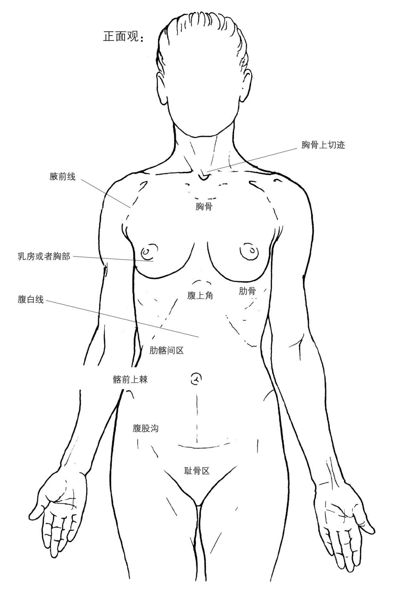
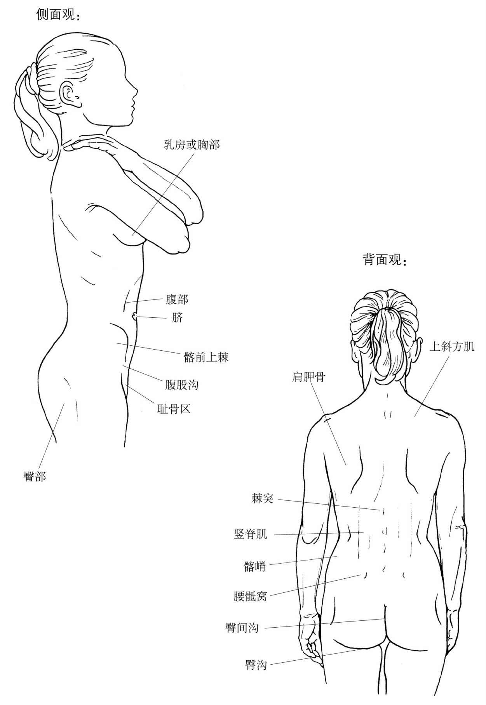

# 20260713《运动解剖书1》第二章 躯干

躯干(trunk)是身体的中心部位。

躯干有两个功能（与脊柱(vertebral column)密切相关）：

- 脊柱能做曲线运动：脊柱由26个关节相叠加构成，具有灵活性
- 躯干能排列并稳固每一块椎骨：静止状态尤其是在负重状态中很重要，因为椎骨间的连接是脆弱——不仅仅体现在关节上，同时也体现在神经上（脊柱的椎管内有脊髓(spinal cord)，而神经根(nerve roots)产生于脊髓）

躯干的这两种能力是通过肌肉来实现的，其中多数为多关节肌(polyarticular muscles)，有的位于躯干深层，由若干小纤维束组成；有的位于躯干浅层，通常由大面积的肌纤维层组成。

## 人体形态学(Landmarks)

正面观(front view): 

- suprasternal notch
- delto-pectoral groove
- sternum

侧面观(side view)：

- pectoral region

背面观(back view)：

- superior trapezius muscle
- 
