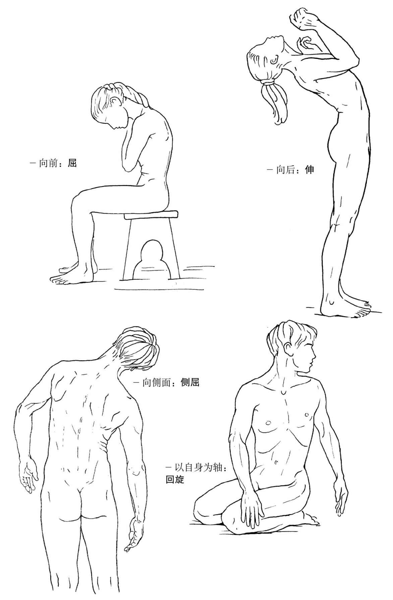
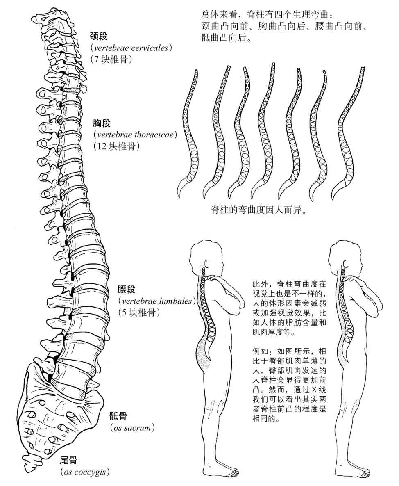
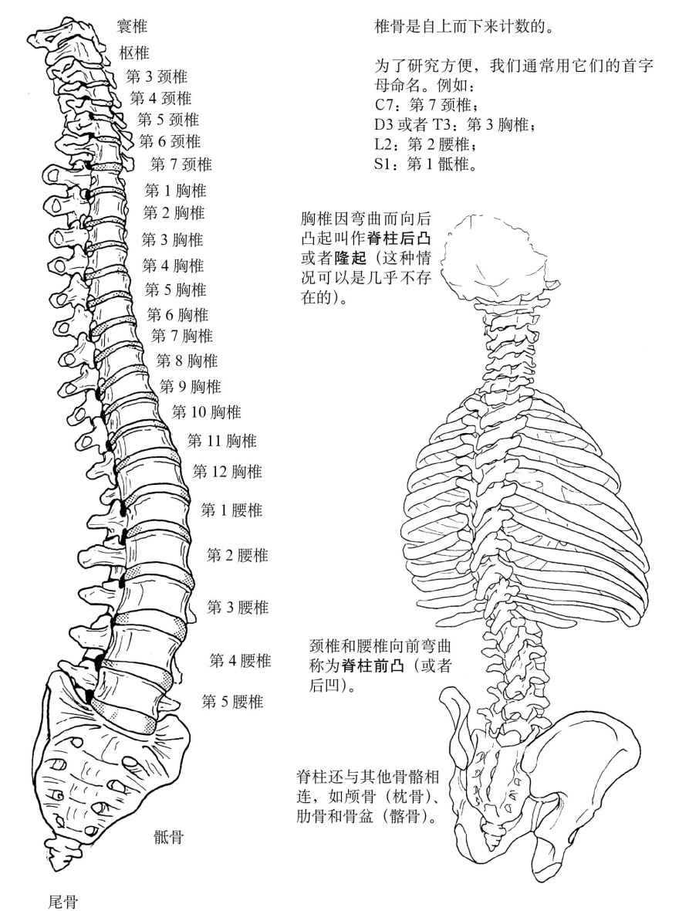
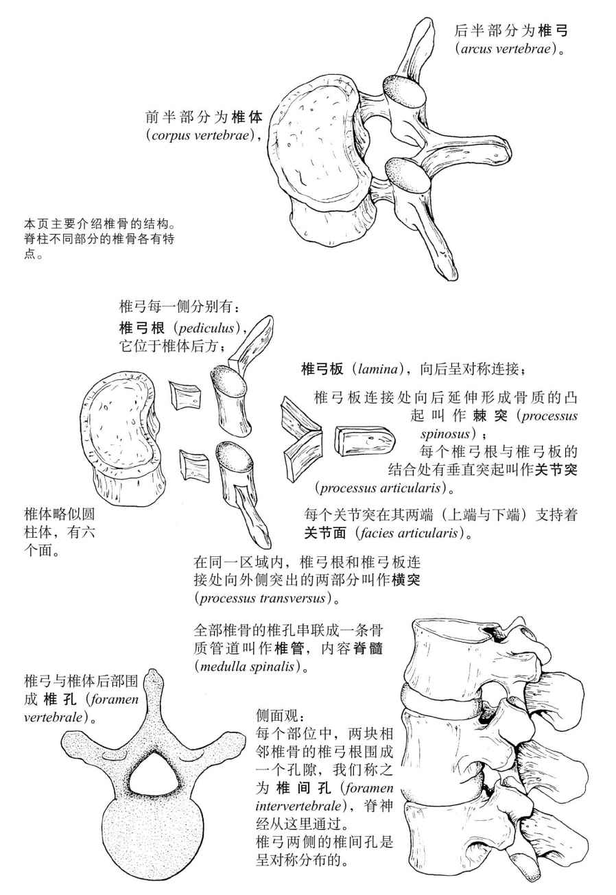
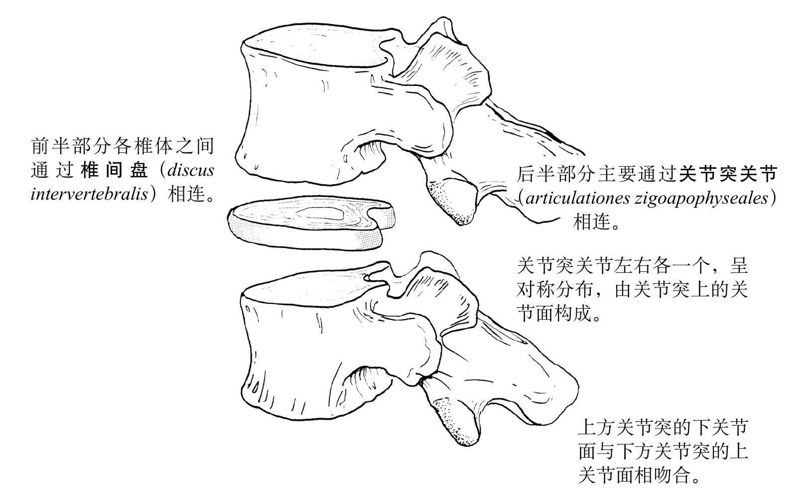
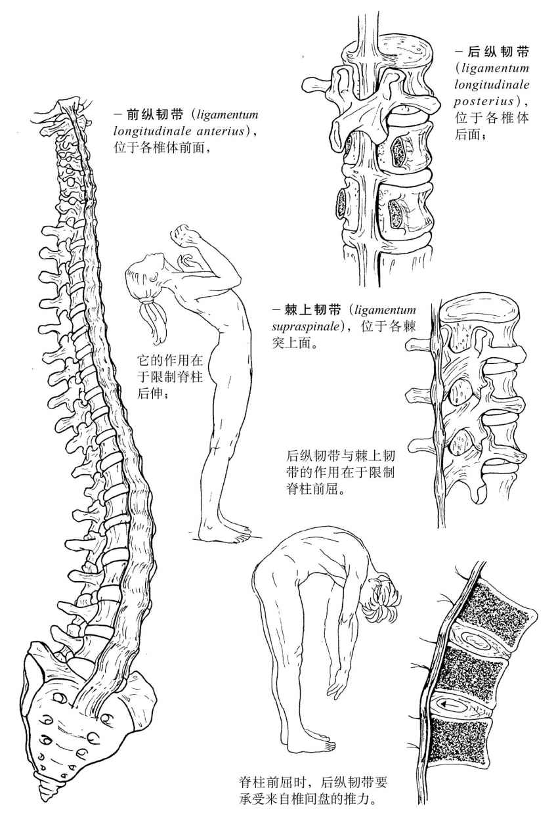
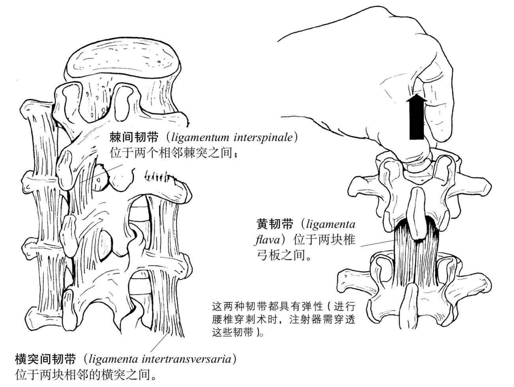
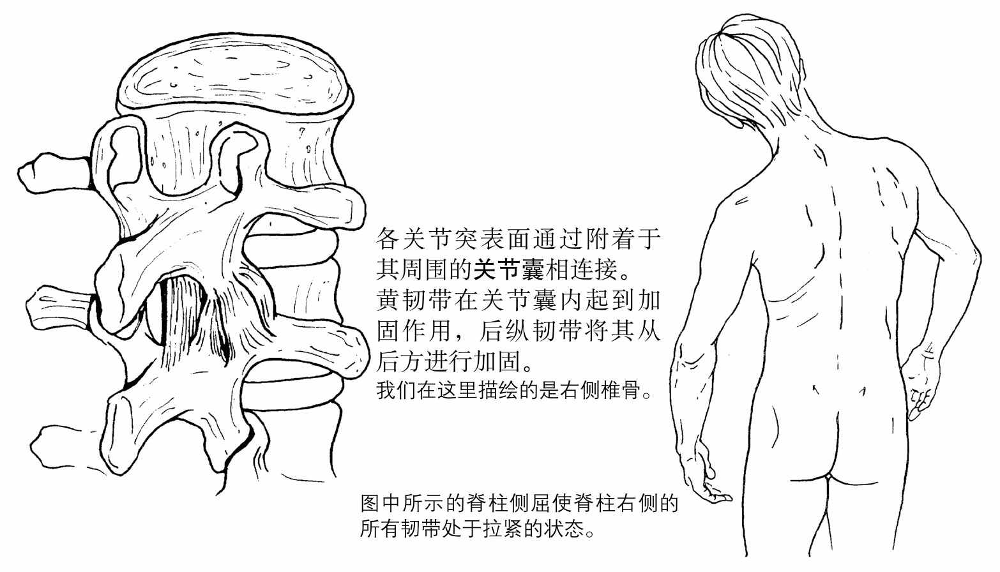

# 20260714《运动解剖书1》第二章 躯干

## 躯干的整体运动

躯干可在多个方向(direction)上运动：

- anteriorly (flexion)
- posteriorly (extension)
- laterally (lateral flexion or sidebending)
- on its own axis (rotation)

不同位置脊椎节段的运动幅度是不同的，这与以下因素有关：

- 椎骨的形态
- 椎间盘与椎体的厚度比例（椎间盘越厚，运动性就越强）
- 肋骨（肋骨限制着胸段脊柱的运动）

## 脊柱（columna vertebralis）

脊柱是可活动的、由骨骼组成的管状结构，它是躯干骨骼的一部分。

脊柱由上至下分为如下几段：

- cervical vertebrae
- thoracic vertebrae
- lumbar vertebrae
- sacrum
- the coccyx or tailbone

脊柱的椎骨自上而下逐渐增大。

- kyphosis/kʌɪˈfəʊsɪs/: excessive outward curvature of the spine, causing hunching of the back
- lordosis/lɔːˈdəʊsɪs/: excessive inward curvature of the spine Compare with kyphosis

## 椎骨结构(Vertebral structure)

每块椎骨(vertebra)由两个主要部分构成：椎体(massive **body**, anterior)和椎弓(**vertebral arch**, posterior)

各椎骨通过三个关节与邻近的椎骨相连：

椎间盘由两部分组成：

- 纤维环，数层呈同心圆状排列的纤维环构成的软骨层，纤维环的排列形状犹如洋葱片；
- 中心部分为髓核，这是含水最多的区域，由胶状黏液构成。

关节突间的关节面（facies articulares）很小，对运动起引导作用。表面覆盖软骨，通过关节囊（capsula articularis）和一些小韧带相连。

整个椎间盘就像一个缓冲器，能承受来自椎骨的极大压力。

## 脊柱韧带(Ligaments of the spinal column)

三条韧带为长韧带，为连续的带状结构，始于枕骨，止于骶骨。

脊柱的其他韧带通常不是连续的，它们逐层分段附着在相邻椎弓的突起上面。

我们用力提起上部的椎骨，就可以看到椎骨间的这些韧带。

