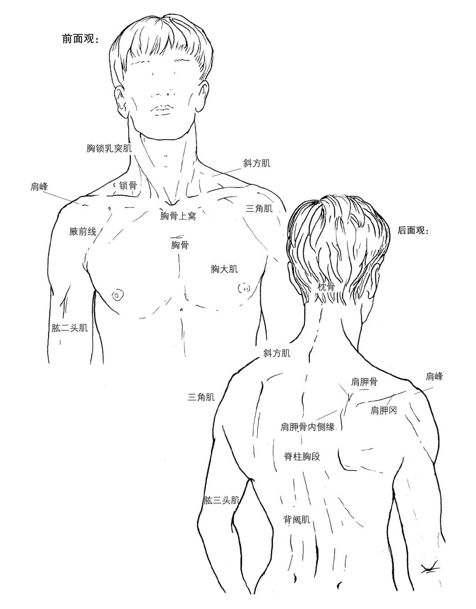
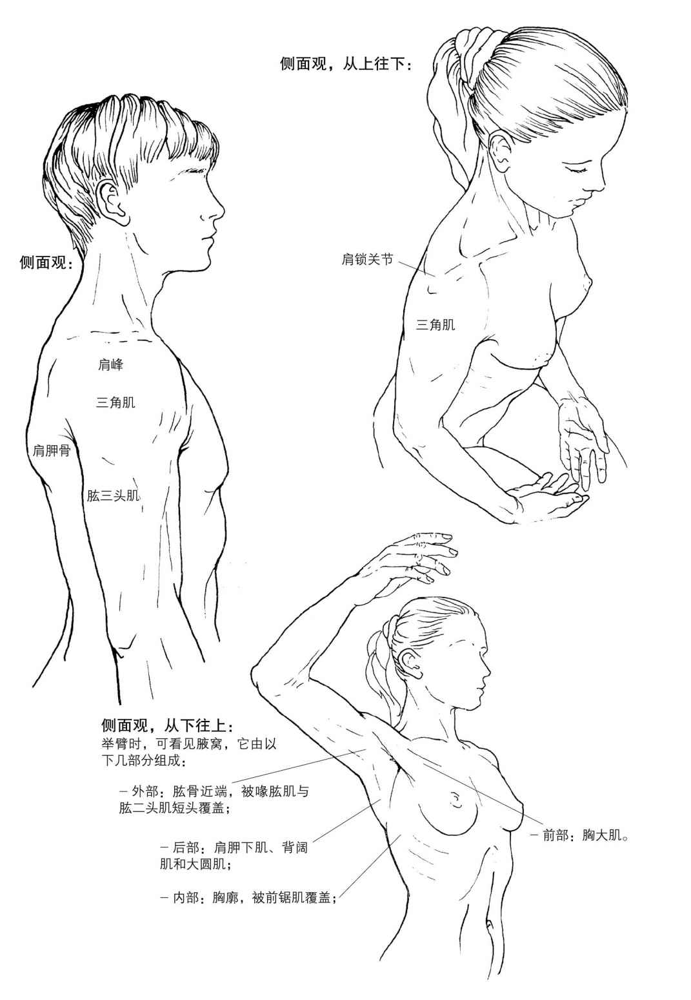
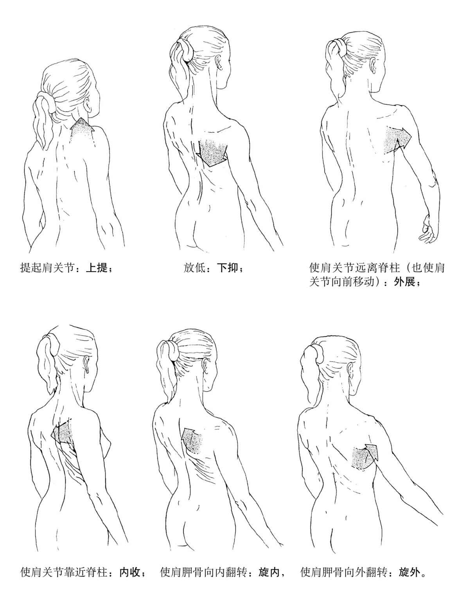
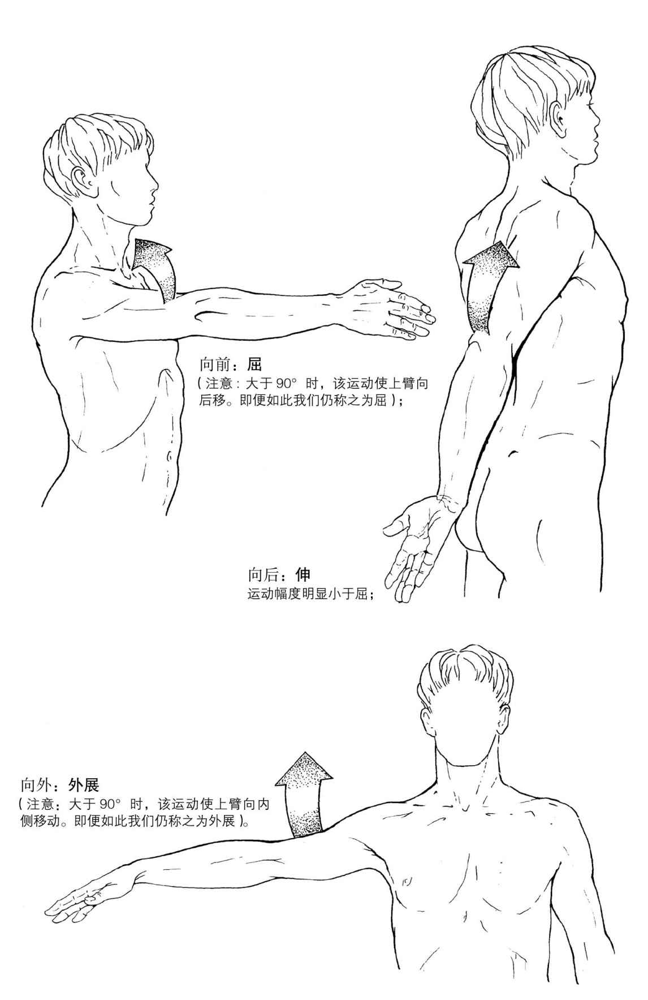
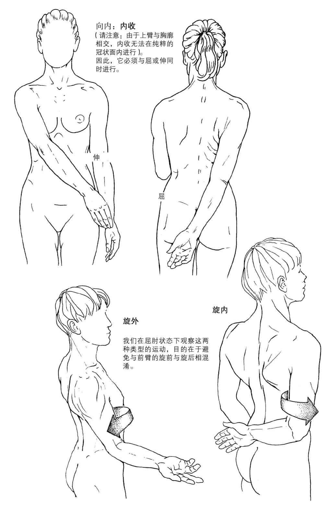
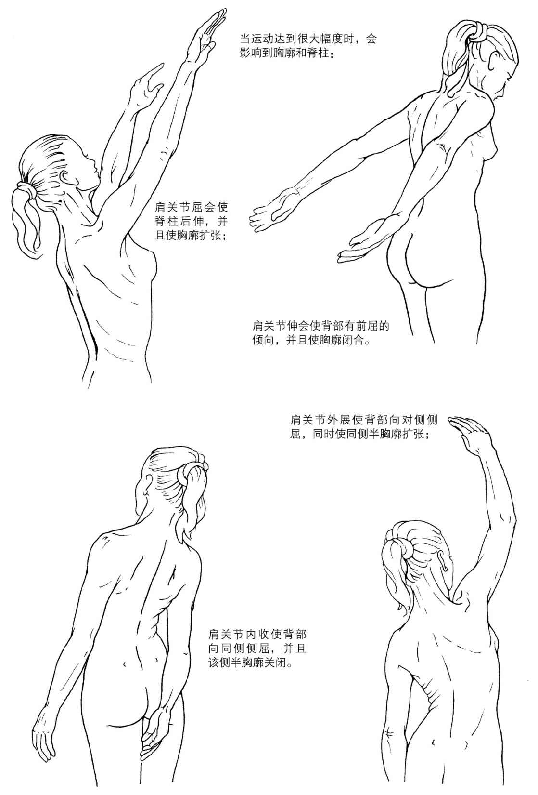
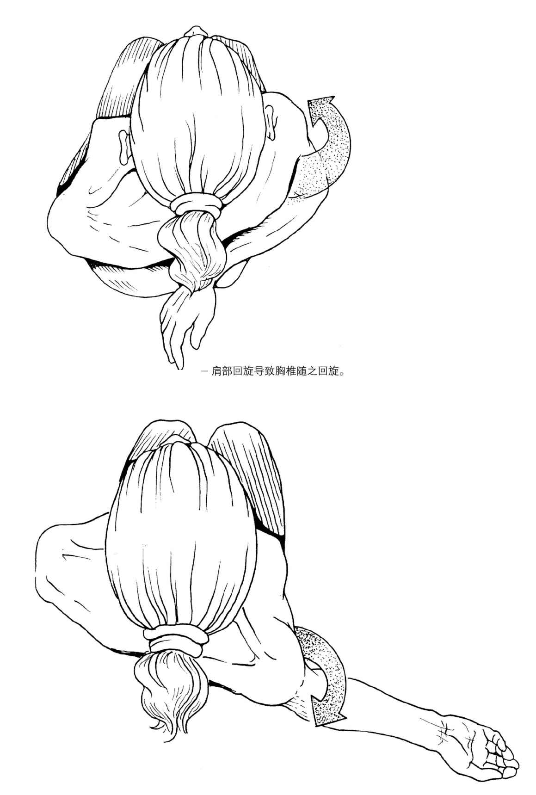

# 20260716《运动解剖书1》第三章 肩部

肩部并不单单指的是肩关节，如同髋部一样，它是一个解剖学与功能学意义上的整体，连接着上肢与胸廓。

肩部具备两个功能：

- 使上臂有很大的运动幅度。上臂的肘关节与腕关节也具有运动性，这就使手部能够在远端围绕躯干运动。
- 保证良好的稳固性，以便在上肢需要力量的情况下（有力的抓取动作、重物搬运、手部支撑等）能提供支持。

肩部由三个关节组成：

- 肩关节（肱骨与肩胛骨）
- 肩锁关节（肩胛骨与锁骨）；
- 胸锁关节（胸骨与锁骨）。

为了考虑一些重要的滑动面，我们定义两个功能不同的部位：

- 肩胛骨和胸廓整体；
- 肩胛骨和肱骨整体。

## 肩部形态学

## 肩部的整体运动

肩部的整体运动可分为两类：

1. 肩关节在胸廓上的运动

   

2. 上臂相对于肩胛骨的肩部运动

   
   
   
   
   
   
   