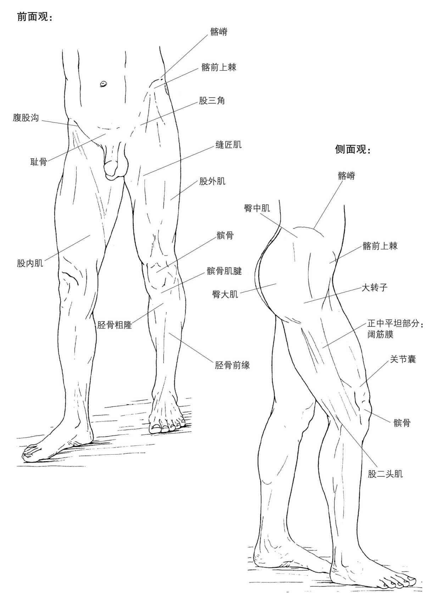
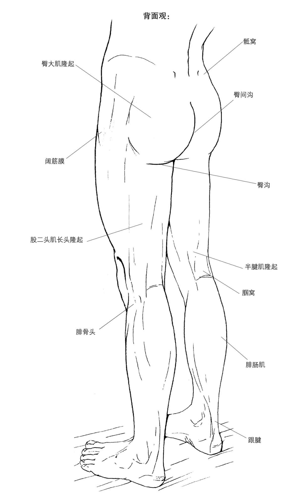
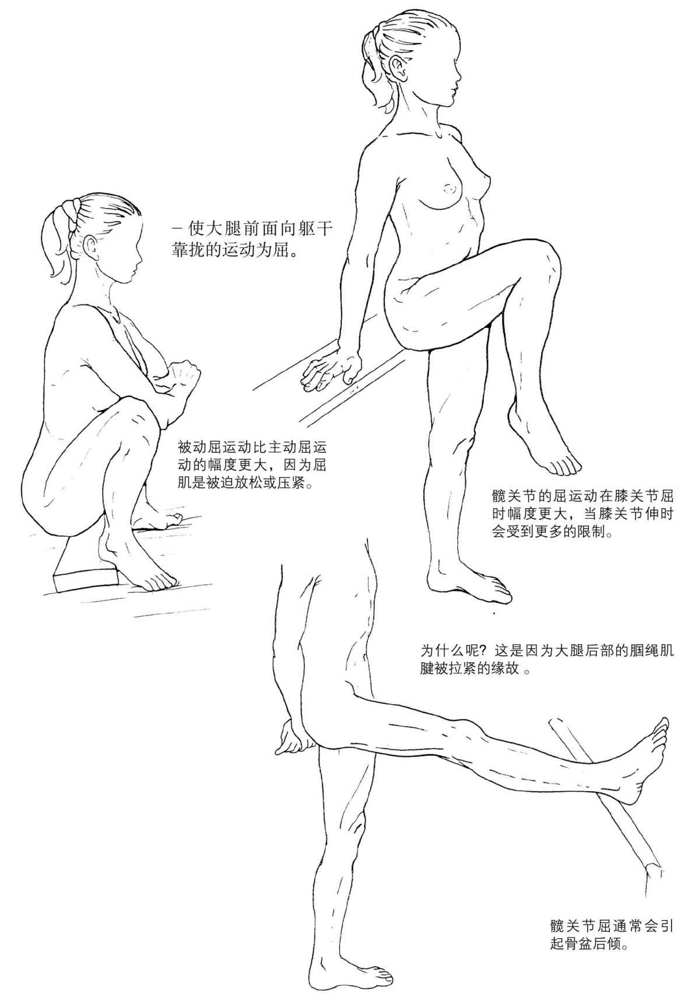
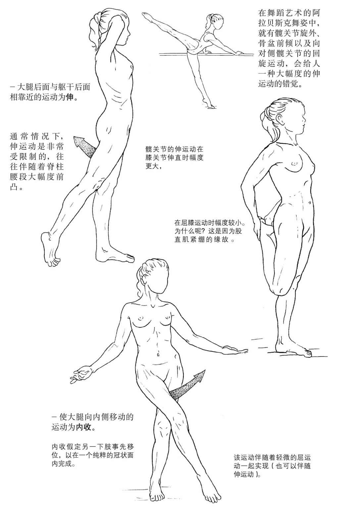
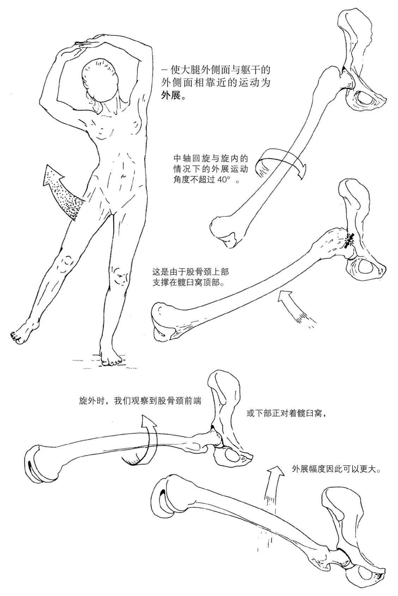
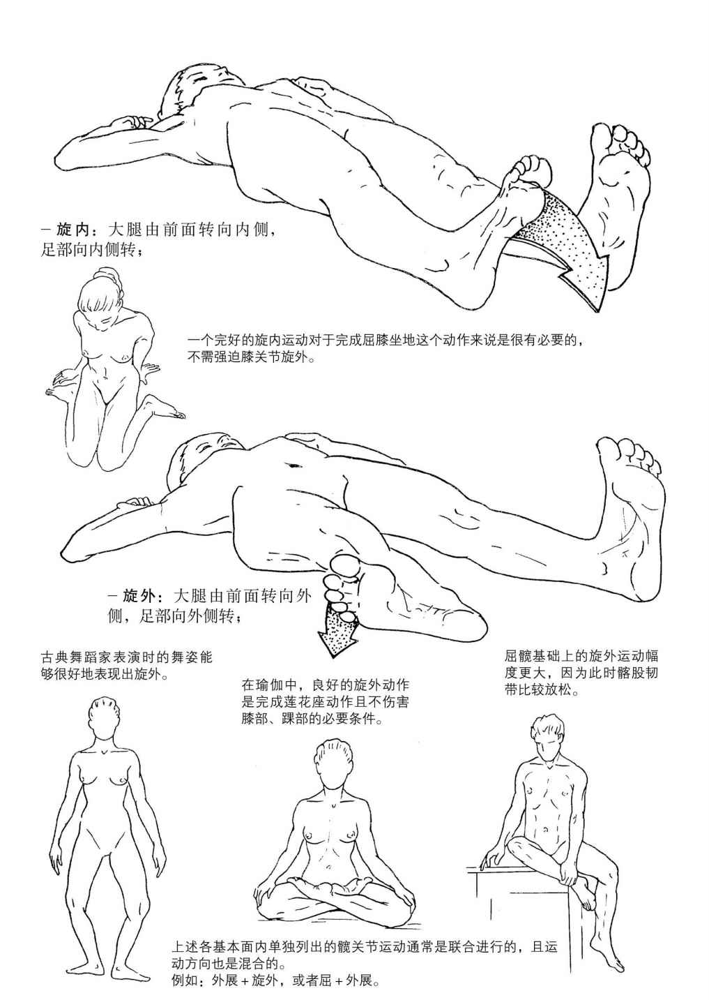
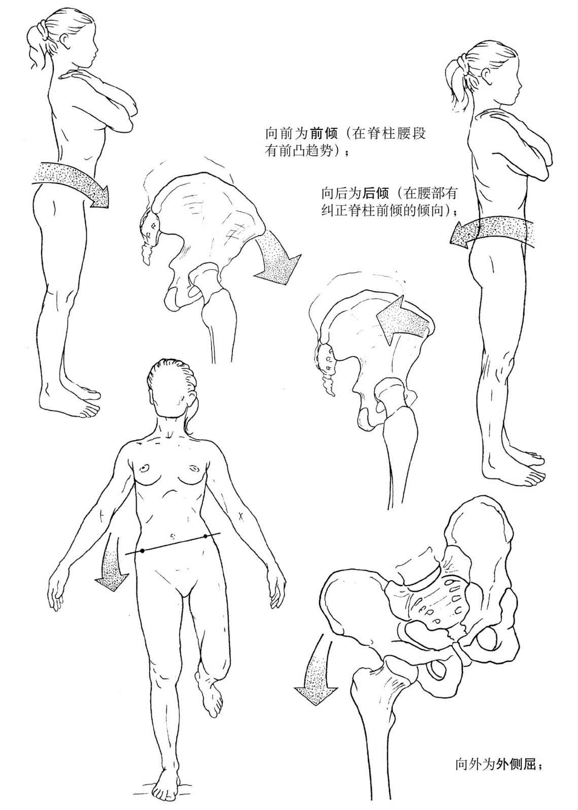
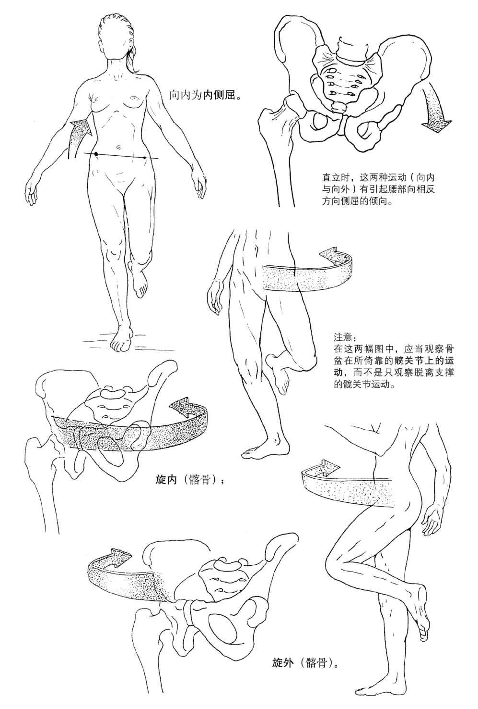

# 20260726《运动解剖书1》第六章 髋与膝

- 髋为下肢的近端关节，连接了股骨与骨盆
  - 人体保持直立行走需要髋部肌肉的稳定性与力量
  - 很多动作需要髋关节做较大幅度的运动：如果髋关节僵硬，则会影响了髋以上部位（腰部）或以下部位（膝部、足部）的运动
- 膝为下肢中部的关节
  - 膝关节具备很强的屈、伸能力，因此膝关节能大幅改变足与躯干之间的距离
  - 膝盖骨骼的稳定性比较弱，主要靠韧带与肌肉加固
  - 膝关节在功能上通常会受到足和髋的影响

## 髋关节与膝关节的形态学

## 髋关节的整体运动

