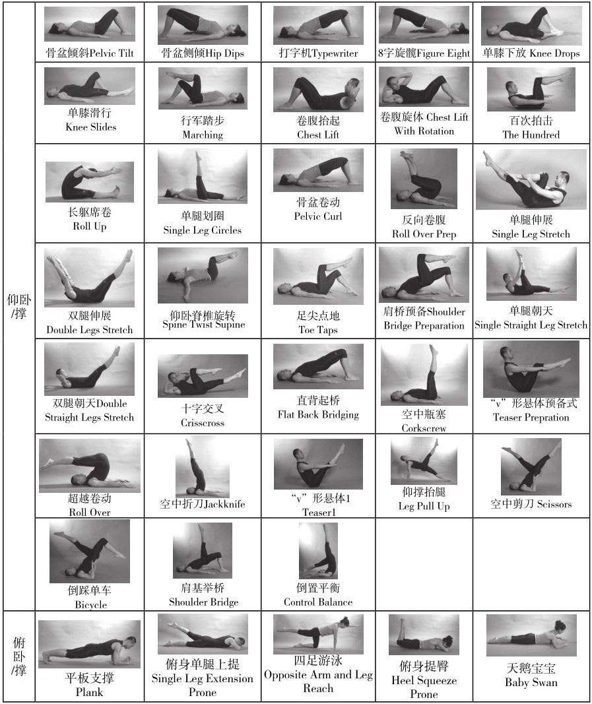
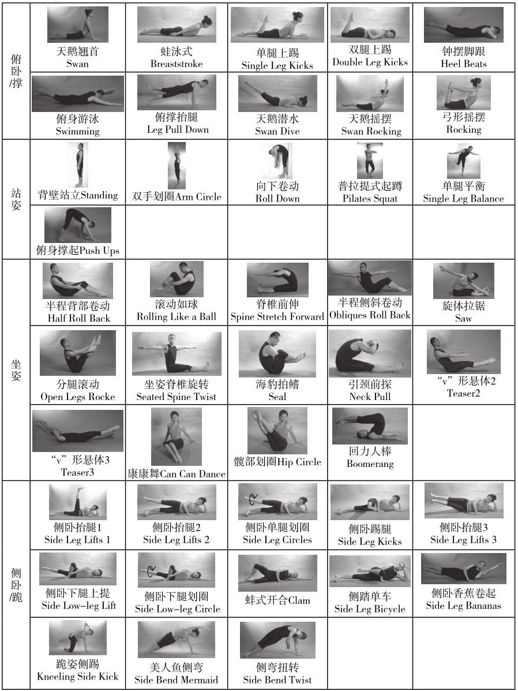

# 20260810《普拉提》Part 5

- 《普拉提》
  - Part 5 普拉提垫上动作及辅助器材练习方法
    - **一、体式动作的基本类型**
    - **二、普拉提垫上常用辅助器材的介绍**

## 一、体式动作的基本类型

所有普拉提的练习动作都是周期性的动态练习，按动作起始时躯干的姿势来分，可以把普拉提垫上的动作分为以下几种基本类型：仰卧/撑、俯卧/撑、站姿、坐姿、侧卧/坐/跪。

## 二、普拉提垫上常用辅助器材的介绍

辅助工具让动作更具乐趣和变化。对于某些动作，它会起到辅助用力的作用，使动作变得更加容易。而在另一些动作中，它可能会让动作变得更加困难，富有挑战，从而促进身体的核心稳定、力量或平衡的发展。

### 普拉提弹力带 (Elastic Band)

普拉提弹力带为薄片带状，由优质橡胶制成，具有弹性。弹力带起初被用于康复病人的物理治疗。

通常弹力带长度1.2米，宽15厘米，厚度根据材质及阻力设计的不同为0.3～0.5毫米。每个公司的弹力带会分成不同的颜色，以区别带子不同的阻力设计。通常手臂和肩部会采用较轻的阻力，而腿部和躯干则会使用较大的阻力级别。

### 泡沫轴 (Foam Roller)

普拉提泡沫轴由聚氨酯泡沫胶 (Ethafoam)制成，一般长度为90厘米，直径在14～15厘米之间，也有短轴和半轴可供选择，是普拉提练习的小工具。

由于运动本感训练系统“Awareness Through Movement”的倡导者和发展者，杰出的健身教练Moishe Feldenkrais最早把泡沫轴引入他的练习中，所以泡沫轴有时也被称为Feldenkrais Roller，或被直接称为Feldenkrais。

泡沫轴能够强化身体核心力量，提升平衡力和协调性，同时也可以用来作背部、腿部，特别是深层肌肉的伸展和放松练习。

### 普拉提魔力圈 (Magic Circle)

普拉提魔力圈，也被称之为阻力圈或魔术圈。

### 普拉提球 (Pilates Ball)

#### （1）普拉提小球 (Small Ball)

专业的普拉提小球，大小各异，由于直接麦管吹起使用，充放气方便，所以也被均为“麦管球”。在有些普拉提练习中我们能够用普拉提小球替代魔力圈放置于双腿之间，用于增加核心的力量，提升核心向内收缩的意识。相比魔力圈，小球提供的阻力要更小，并且当你挤压时触感更为温和，如果有伤，或者感觉魔力圈的阻力过大，那么普拉提小球会是更好的选择。

#### （2）普拉提健身球 (Fitness Ball)

普拉提健身球也称为健身球（Gymball）。健身球1963年在瑞士诞生，因此也称为“瑞士球”（Swiss Ball），健身球由聚乙烯材料制成，中空可充气，其颜色、大小种类繁多。在训练中，一般根据练习者身高以及动作的要求来选择球的大小。除了不同球的大小，球的充气程度也会影响到动作的难易程度。

健身球和前面介绍的几个普拉提小器材一样，最初被瑞士的医生用于医疗康复领域，将它专门运用于脑瘫儿童和脊椎康复的运动治疗，随着它在协调、康复腰、背、颈、髋膝盖等功能作用的发挥，逐渐被延伸推广为一种流行的健康运动，近10来年，健身球才被广泛的应用于大众健身的用途。

健身球结合普拉提的练习动作，球的不稳定性会促使练习者不断调节其神经肌肉系统，发展其平衡和控制能力，使他集中注意在平衡躯体的那些核心肌群上。能够训练练习者身体的平衡能力及协调性，发展练习者其肌肉力量、柔韧性和平衡能力，并有助矫正体型、预防背痛。

#### （3）BOSU球

BOSU意为“BOth Side Up”（两面朝上），在国内按音译有时也有把它称为“博速球”。1999年，它的创造者David Wreck由于在健身球上练习一个传统的平衡动作时又一次意外跌落后，一念之下设计了这个BOSU球，在另一侧加上塑料平面硬底，这样使得在练习一些健身球的动作时能够避免一些难以控制的危险。

### 平衡垫 (Balance Cushion)

平衡垫为中空，可以充气，所以也称“气枕”。它直径大约在30～40厘米不等，体积小，携带方便。在普拉提练习中，通常作为一个不稳定的支撑平面，来加强动作的难度。放在双脚下、单脚下、肩背下都非常方便，不稳定的平衡气垫能够迅速调动你身体的深层肌肉，强化你的核心。对老年人和慢性下背痛者，平衡垫都是一个非常有用的小工具。